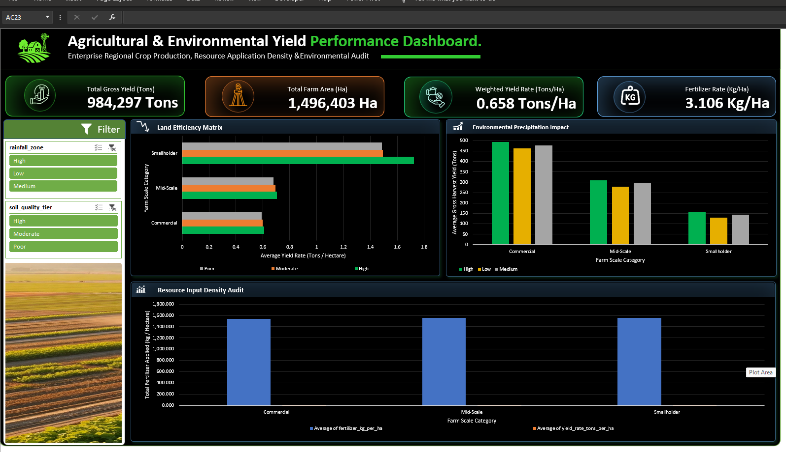
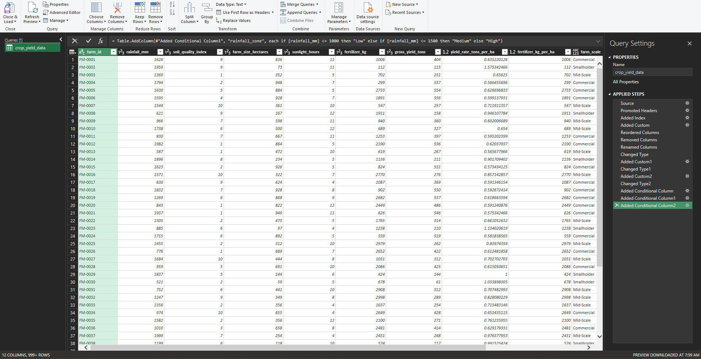

# Synthetic Agricultural Yield Analytics

An Excel dashboard built on simulated farm performance data to explore relationships between output, area, soil quality, rainfall, fertilizer intensity, and farm scale.

> **Data note:** The public repository does not redistribute the underlying 3,000-row farm dataset or the Excel workbook. The original provenance and licensing of the raw rows could not be independently established, so this repository keeps the documentation, screenshots, and derived findings without publishing the raw file.



## What Was Done

1. Built the analysis from a local working copy of the farm-level data.
2. Validated the source data for completeness and duplication checks.
3. Added derived fields: `farm_id`, `gross_yield_tons`, `yield_rate_tons_per_ha`, `fertilizer_kg_per_ha`, `farm_scale`, `soil_quality_tier`, and `rainfall_zone`.
4. Summarised the data in PivotTables.
5. Built a dashboard with KPI cards, three charts, and two slicers (soil quality tier, rainfall zone).
6. Calculated the correlation between farm size and gross yield on the `Correlation_Check` sheet.



## Dataset

The raw file `data/crop_yield_data.csv` is not redistributed in this public repository. The workbook in `dashboard/` is not published as a downloadable asset for the same reason. The field catalogue below describes the working schema used in the underlying analysis and the public-facing documentation.

| Field | Range | Description |
|---|---|---|
| `rainfall_mm` | 500 – 2,000 | Growing-season rainfall (mm) |
| `soil_quality_index` | 1 – 10 | Soil rating (1 poor, 10 excellent) |
| `farm_size_hectares` | 10 – 1,000 | Farm area (ha) |
| `sunlight_hours` | 4 – 12 | Average daily sunlight hours |
| `fertilizer_kg` | 100 – 3,000 | Fertilizer applied, kg per hectare |
| `crop_yield` | 46 – 628 | Crop output per farm record |

**Assumption:** The source describes `crop_yield` as tons per hectare. This project treats it as total output per farm record (`gross_yield_tons`) and derives yield per hectare by dividing by farm area. The assumption could not be confirmed against a real-world source because the raw data is not redistributed here and the original provenance could not be independently established.

## Derived Fields

| Field | Definition |
|---|---|
| `gross_yield_tons` | `crop_yield`, renamed |
| `yield_rate_tons_per_ha` | `gross_yield_tons` ÷ `farm_size_hectares` |
| `fertilizer_kg_per_ha` | `fertilizer_kg` (already per hectare; not divided by area) |
| `farm_scale` | Smallholder ≤ 250 ha; Mid-Scale 251–600 ha; Commercial > 600 ha |
| `soil_quality_tier` | Poor 1–3; Moderate 4–7; High 8–10 |
| `rainfall_zone` | Low 500–1,000 mm; Medium 1,001–1,500 mm; High 1,501–2,000 mm |

## Results

| Measure | Value |
|---|---|
| Total gross yield | 984,297 tons |
| Total farm area | 1,496,403 ha |
| Weighted yield rate (total yield ÷ total area) | 0.66 tons/ha |
| Average fertilizer rate | 1,549 kg/ha |
| Correlation, farm size (ha) and gross yield (tons) | 0.989 |

| Farm scale | Farms | Total yield (t) | Avg yield per farm (t) | Avg yield rate (t/ha) |
|---|---|---|---|---|
| Smallholder | 772 | 111,387 | 144.3 | 1.56 |
| Mid-Scale | 1,051 | 309,273 | 294.3 | 0.69 |
| Commercial | 1,177 | 563,637 | 478.9 | 0.60 |

- Commercial farms produce the most in total and per farm because they cover the most land.
- Yield rate per hectare is highest for Smallholder farms. The rate is output divided by farm area, so this comparison reflects that division and is not, on its own, evidence that smaller farms are more efficient.
- Within each farm scale, average yield rises from the lowest to the highest soil tier and rainfall zone, but the differences are small compared with the differences between farm scales.
- Average fertilizer rate is about the same in every farm scale (1,540 – 1,556 kg/ha).
- Farm size and gross yield are strongly correlated (0.989), so recorded output rises with farm size. This is a description of how the two columns move together, not a statement of cause and effect.

## Limitations

- The data is synthetic and has no location, date or crop-type information.
- Treating `crop_yield` as total output is an assumption.
- Results are descriptive group averages; no statistical testing was performed.
- Farm scale, soil tier and rainfall zone cut points are analyst-defined.

## Repository Structure

```
├── README.md
├── data/                     (raw farm dataset excluded from public repository)
├── dashboard/                (public-facing workbook withheld from publication)
├── docs/
│   ├── 1_Data_Dictionary_and_Field_Catalog.docx
│   ├── 2_Executive_Briefing_and_Business_Insights.docx
│   ├── 3_System_Architecture_and_Technical_Documentation.docx
│   └── 4_User_Operating_and_Maintenance_Manual.docx
└── images/
    ├── dashboard-overview.png
    ├── power-query-editor.png
    ├── data-table.png
    └── correlation-check.png
```

## How to Use

This public repository is documentation-first: reviewers can inspect the methodology, checks, and screenshots without accessing the original raw records. The original workbook and raw CSV were excluded because their provenance/licensing could not be independently verified.

1. Review the dashboard screenshots and methodology in this repository.
2. Use the documentation in `docs/` to understand the analysis flow and conclusions.
3. Do not expect the raw rows to be regenerated from this public repository alone.

See `docs/` for the data dictionary, briefing, technical documentation, and user manual.

## Tools

Excel, Power Query, PivotTables.

## Author

John O. Ezekiel
